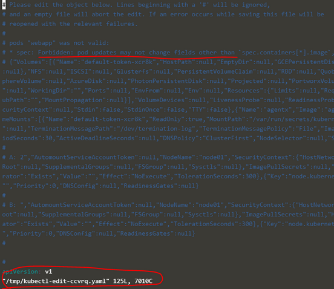
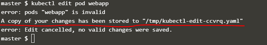

# Resource Limits
  - Take me to [Video Tutorials](https://kodekloud.com/topic/resource-limits/)
  
In this section we will take a look at Resource Limits

#### Let us take a look at 3 node kubernetes cluster.
- Each node has a set of CPU, Memory and Disk resources available.
- Every POD requires a set of resources to RUN. Each time a POD is placed on a NODE it consumes the resources available on that NODE.
- The Scheduler decides which POD will be scheduled on which NODE. The Scheduler takes into considaration the amount of resources required by a POD and those available on the NODEs and it identifies the "best" NODE available for that particular POD.
- If there is no sufficient resources available on any of the nodes, kubernetes holds the scheduling the pod. You will see the pod in `pending` state. If you look at the events (using the `kubectl describe pod {POD_NAME}` command), you will see (in our example) the reason as insufficient CPU.
  
  
  
## Resource Requirements
- By default, K8s assume that a pod or container within a pod requires **`0.5`** CPU and **`256Mi`** of memory. This is known as the **`Resource Request` for a container**.
  
  
  
- If your application within the pod requires more than the default resources, you need to set them in the pod definition file.

  ```
  apiVersion: v1
  kind: Pod
  metadata:
    name: simple-webapp-color
    labels:
      name: simple-webapp-color
  spec:
   containers:
   - name: simple-webapp-color
     image: simple-webapp-color
     ports:
      - containerPort:  8080
     resources:
       requests:
        memory: "1Gi"
        cpu: "1"
  ```
   


  ### Resource - CPU
  - So what does "1 count of CPU" really means?
    * We can specify any value as low as `0.1` (or equivalent to that would be `100m` - where `m` stands for `mili`. We can go as low as `1m` but not lower than that).
    * 1 Count of CPU is equivalent to `1 vCPU` in AWS (or `1 GCP Core` or `1 Azure Core` or `1 Hyperthread`).
   
  ### Resource - Memory
  - We can specify `256 Mi` or `268435456 MEM` or `268 M`.
  - There's a difference between `Mi` and `M` -> reference to kubernetes documentation on this matter.

  
## Resources - Limits
- By default, k8s sets resource limits to 1 CPU and 512Mi of memory
  
  
  
- You can set the resource limits in the pod definition file.
  
  ```
  apiVersion: v1
  kind: Pod
  metadata:
    name: simple-webapp-color
    labels:
      name: simple-webapp-color
  spec:
   containers:
   - name: simple-webapp-color
     image: simple-webapp-color
     ports:
      - containerPort:  8080
     resources:
       requests:
        memory: "1Gi"
        cpu: "1"
       limits:
         memory: "2Gi"
         cpu: "2"
  ```
  


#### Note: Remember Requests and Limits for resources are set per container in the pod.
  
## Exceed Limits
- what happens when a pod tries to exceed resources beyond its limits?
-> This might suffocate the native processes on the NODE or other containers of resources.

- In case a POD tries to "exceed" the CPU beyond it's specified limit, the system will "THROTTLE" the CPU so it does not go beyond the specified limit, in this case the Conatainer can now use more CPU than it's limit.
- Incase a POD tries to "exceed" the Memory beyond it's specified limit, the Container "can" use more memory resources than it's limit, so if a POD tries to consume more memory than it's limit constantly then POD will be "TERMINATED" with an "OOM (Out Of Memory)" log in the "describe command"

- We can set a limit to the 

   
   

## Behaviour
- With default configurations there's no limits, in which case every POD can use as much resources as it needs, in which case a POD has a potential of "suffocating" the CPU/Memory and prevent from other PODs being deployed and etc...
- In case of "NO REQUESTS" && "NO LIMITS" -> This is the "default behaviour" as explained above.
- In case of "NO REQUESTS" && "WITH LIMITS" -> Kubernetes will automatially do "REQUESTS" = "LIMITS".
- In case of "WITH REQUESTS" && "WITH LIMITS" -> The PODs will get the resources they need but will not be able to request more than the "REQUESTS".
- In case of "WITH REQUESTS" && "NO LIMITS" -> The PODs will get the resources they need, but in case some POD needs more resources it will get them as long as there are more "free" resources available on the NODE (the resources are either free that no POD has requested or in cases where there are PODs with no "REQUESTS" set on that NODE). -> This is TRUE for CPU, in case of Memory the POD if requests more Memory than available, then it will suffocate other PODs.

## LimitRange
- Check the Kubernetes documentation for more information regarding this feature -> this can help us define default limit sets for Containers. This object that is created with an YAML file and is applicable at the "namespace" level.

## Resource Quotas
- Helps us to limit resource usage on the applications deployed in all the PODs that are deployes in the Kubernetes cluster on the "namespace" level. For example limits like all the PODs in the Cluster cannot use more than `X CPU` or `Y Memory` in the Cluster.


#### K8s Reference Docs:
- https://kubernetes.io/docs/concepts/configuration/manage-resources-containers/
  


# A quick note on editing Pods and Deployments

## Edit a POD
Remember, you CANNOT edit specifications of an existing POD other than the below.
- `spec.containers[*].image`
- `spec.initContainers[*].image`
- `spec.activeDeadlineSeconds`
- `spec.tolerations`

For example you cannot edit the environment variables, service accounts, resource limits (all of which we will discuss later) of a running pod. But if you really want to, you have 2 options:

1. Run the kubectl edit pod <pod name> command.  This will open the pod specification in an editor (vi editor). Then edit the required properties. When you try to save it, you will be denied. This is because you are attempting to edit a field on the pod that is not editable. 




A copy of the file with your changes is saved in a temporary location as shown above.
You can then delete the existing pod by running the command:
`kubectl delete pod webapp`

Then create a new pod with your changes using the temporary file
`kubectl create -f /tmp/kubectl-edit-ccvrq.yaml`


2. The second option is to extract the pod definition in YAML format to a file using the command
`kubectl get pod webapp -o yaml > my-new-pod.yaml`

Then make the changes to the exported file using an editor (vi editor). Save the changes
`vi my-new-pod.yaml`

Then delete the existing pod
`kubectl delete pod webapp`

Then create a new pod with the edited file
`kubectl create -f my-new-pod.yaml`


## Edit Deployments

With Deployments you can easily edit any field/property of the POD template. Since the pod template is a child of the deployment specification,  with every change the deployment will automatically delete and create a new pod with the new changes. So if you are asked to edit a property of a POD part of a deployment you may do that simply by running the command

`kubectl edit deployment my-deployment`
